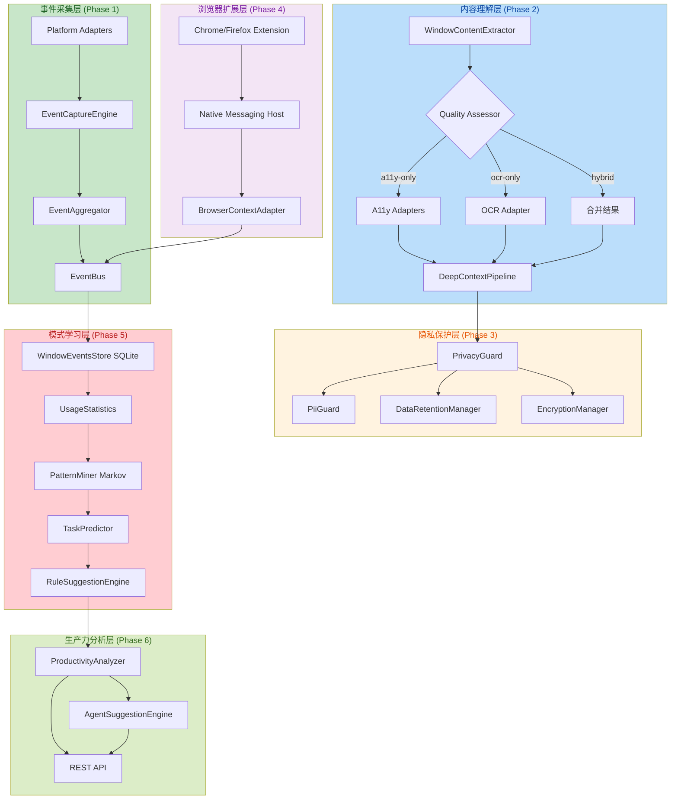

# Context-Aware System 完整实现文档

> **项目**: OpenJarvis  
> **版本**: v1.0.0  
> **最后更新**: 2026-05-29  
> **状态**: ✅ 全部完成（Phase 1-6）

---

## 📋 目录

- [系统概述](#系统概述)
- [Phase 1: 事件驱动架构重构](#phase-1-事件驱动架构重构)
- [Phase 2: Accessibility Tree 深度内容提取](#phase-2-accessibility-tree-深度内容提取)
- [Phase 3: 隐私增强与权限控制](#phase-3-隐私增强与权限控制)
- [Phase 4: 浏览器扩展集成](#phase-4-浏览器扩展集成)
- [Phase 5: 行为模式学习](#phase-5-行为模式学习)
- [Phase 6: 量化自我与生产力分析](#phase-6-量化自我与生产力分析)
- [架构设计](#架构设计)
- [核心 API](#核心-api)
- [数据流](#数据流)
- [测试覆盖](#测试覆盖)
- [部署与配置](#部署与配置)

---

## 系统概述

Context-Aware System 是 OpenJarvis 的核心上下文感知系统，通过 6 个 Phase 实现了从**被动响应**到**主动服务**的完整能力栈：

| Phase | 功能 | 状态 | 核心价值 |
|-------|------|------|---------|
| **Phase 1** | 事件驱动架构 | ✅ 完成 | 跨平台事件采集基础设施 |
| **Phase 2** | Accessibility Tree 提取 | ✅ 完成 | 深度窗口内容理解 |
| **Phase 3** | 隐私保护 | ✅ 完成 | 6 种 PII 脱敏 + 数据加密 |
| **Phase 4** | 浏览器扩展 | ✅ 完成 | 精确 URL/页面内容获取 |
| **Phase 5** | 行为模式学习 | ✅ 完成 | Markov 链 + 频繁模式挖掘 |
| **Phase 6** | 生产力分析 | ✅ 完成 | 日报/周报 + Agent 主动建议 |

### 技术栈

- **运行时**: Node.js ESM
- **数据库**: better-sqlite3 + FTS5 全文搜索
- **跨平台**: Windows/macOS/Linux 原生适配
- **浏览器**: Chrome Extension (Manifest V3) + Firefox (V2/V3)
- **算法**: Markov 链、频繁模式挖掘（PrefixSpan 简化版）
- **API**: Hono.js REST API

---

## Phase 1: 事件驱动架构重构

### 目标

构建跨平台的事件采集基础设施，实现应用切换、窗口焦点、用户交互等事件的统一捕获和处理。

### 核心组件

#### 1. EventCaptureEngine

**文件**: [`lib/events/event-capture-engine.js`](file:///e:/A_Project/open-jarvis/lib/events/event-capture-engine.js)

**功能**:
- 事件采集引擎主控，协调平台适配器和聚合器
- 自动检测平台能力（Windows/macOS/Linux）
- 支持 Native 模式和 Polling Fallback 模式

**关键 API**:
```javascript
const engine = new EventCaptureEngine({
  platform: process.platform,
  useNative: false, // 当前使用 polling fallback
});

await engine.start();
engine.on("event", (event) => {
  console.log("捕获事件:", event.type, event.app);
});
```

#### 2. EventAggregator

**文件**: [`lib/events/event-aggregator.js`](file:///e:/A_Project/open-jarvis/lib/events/event-aggregator.js)

**功能**:
- 事件去重/合并/节流
- 防风暴机制：最小间隔 200ms，最大间隔 10s
- 按事件类型差异化 debounce（200ms-5s）

**节流策略**:
| 事件类型 | Debounce 时间 | 去重键 |
|---------|--------------|--------|
| `app:switch` | 300ms | `app:switch\|{app}` |
| `window:focus` | 300ms | `window:focus\|{app}\|{title}` |
| `ui:click` | 200ms | `ui:click\|{app}` |
| `input:typing` | 500ms | `input:typing\|{app}` |
| `clipboard:copy` | 200ms | `clipboard:copy\|{contentHash}` |

#### 3. CapabilityDetector

**文件**: [`lib/events/capability-detector.js`](file:///e:/A_Project/open-jarvis/lib/events/capability-detector.js)

**功能**:
- 探测当前平台支持的事件捕获能力
- 返回详细的能力清单和原因说明

**支持的能力**:
- `appSwitch` - 应用切换检测
- `windowFocus` - 窗口焦点检测
- `mouseClick` - 鼠标点击检测
- `typingPause` - 输入暂停检测
- `clipboardCopy` - 剪贴板复制检测
- `idleFallback` - 空闲兜底（纯 JS 实现，总是可用）

#### 4. Platform Adapters

| 适配器 | 文件 | 实现方式 |
|-------|------|---------|
| Windows | [`lib/events/platform/windows-event-hook.js`](file:///e:/A_Project/open-jarvis/lib/events/platform/windows-event-hook.js) | Win32 API Hook |
| macOS | [`lib/events/platform/macos-event-tap.js`](file:///e:/A_Project/open-jarvis/lib/events/platform/macos-event-tap.js) | CGEventTap |
| Linux | [`lib/events/platform/linux-event-monitor.js`](file:///e:/A_Project/open-jarvis/lib/events/platform/linux-event-monitor.js) | X11/Wayland Polling |

#### 5. Native Modules

**目录**: [`native/event-hook/`](file:///e:/A_Project/open-jarvis/native/event-hook/)

包含 N-API 原生模块骨架：
- `win32_hook.cc` - Windows 原生事件钩子
- `macos_hook.mm` - macOS 原生事件 tap
- `linux_hook.cc` - Linux 原生事件监听

### 数据流

```
用户操作 → Platform Adapter → EventCaptureEngine → EventAggregator → EventBus
           (raw events)        (orchestration)      (debounce)       (emit)
```

---

## Phase 2: Accessibility Tree 深度内容提取

### 目标

通过 Accessibility Tree + OCR 双通道策略，深度提取窗口内容，实现比窗口标题更精确的上下文理解。

### 核心组件

#### 1. WindowContentExtractor

**文件**: [`lib/context/window-content-extractor.js`](file:///e:/A_Project/open-jarvis/lib/context/window-content-extractor.js)

**功能**:
- 统一的内容提取接口
- 协调 a11y + OCR 双通道提取
- 智能策略选择（4 种策略）

**提取策略**:
| 策略 | 触发条件 | 说明 |
|------|---------|------|
| `a11y-only` | a11y 质量高 | 仅使用 Accessibility Tree |
| `ocr-only` | a11y 质量低 | 仅使用 OCR 截图识别 |
| `hybrid` | a11y 质量中等 | 合并 a11y + OCR 结果 |
| `skip` | 应用被排除 | 不提取内容 |

**使用示例**:
```javascript
const extractor = new WindowContentExtractor({
  platform: process.platform,
  adapters: {
    win32: new WindowsUiaAdapter(),
    darwin: new MacosAxAdapter(),
    linux: new LinuxAtspiAdapter(),
  },
});

const result = await extractor.extract({ app: "Code.exe", title: "main.js" });
console.log(result.elements.length, "个 UI 元素");
console.log(result._strategy, "提取策略");
```

#### 2. ContentQualityAssessor

**文件**: [`lib/context/content-quality-assessor.js`](file:///e:/A_Project/open-jarvis/lib/context/content-quality-assessor.js)

**功能**:
- 评估 a11y 文本质量
- 根据质量分数决定提取策略

**评估指标**:
- 文本长度
- 元素数量
- 应用类型（IDE、浏览器、终端等）

#### 3. DeepContextPipeline

**文件**: [`lib/context/deep-context-pipeline.js`](file:///e:/A_Project/open-jarvis/lib/context/deep-context-pipeline.js)

**功能**:
- 协调 L1/L2/L3 三层上下文采集
- 按隐私级别控制采集深度

**三层架构**:
| 层级 | 触发条件 | 内容 | 隐私级别 |
|------|---------|------|---------|
| **L1** | 窗口焦点变化 | 应用名 + 标题 | 所有级别 |
| **L2** | 窗口停留 5s+ | 文件内容/a11y/剪贴板 | standard/full |
| **L3** | 按需触发 | 截图 + 视觉分析 | full |

**隐私级别**:
- `minimal` - 仅 L1（最保守）
- `standard` - L1 + L2（默认）
- `full` - L1 + L2 + L3（最全面）

#### 4. Platform A11y Adapters

| 适配器 | 文件 | 技术 |
|-------|------|------|
| Windows UIA | [`lib/context/adapters/windows-uia-adapter.js`](file:///e:/A_Project/open-jarvis/lib/context/adapters/windows-uia-adapter.js) | UI Automation API |
| macOS AX | [`lib/context/adapters/macos-ax-adapter.js`](file:///e:/A_Project/open-jarvis/lib/context/adapters/macos-ax-adapter.js) | Accessibility API |
| Linux AT-SPI | [`lib/context/adapters/linux-atspi-adapter.js`](file:///e:/A_Project/open-jarvis/lib/context/adapters/linux-atspi-adapter.js) | AT-SPI2 D-Bus |
| OCR Fallback | [`lib/context/adapters/ocr-fallback-adapter.js`](file:///e:/A_Project/open-jarvis/lib/context/adapters/ocr-fallback-adapter.js) | Tesseract.js |

#### 5. 内容适配器（特殊应用类型）

| 适配器 | 文件 | 功能 |
|-------|------|------|
| IDE Content | [`lib/context/adapters/ide-content-adapter.js`](file:///e:/A_Project/open-jarvis/lib/context/adapters/ide-content-adapter.js) | 提取当前打开的文件内容 |
| Browser Content | [`lib/context/adapters/browser-adapter.js`](file:///e:/A_Project/open-jarvis/lib/context/adapters/browser-adapter.js) | 提取 URL + 页面标题 |
| Terminal Content | [`lib/context/adapters/terminal-adapter.js`](file:///e:/A_Project/open-jarvis/lib/context/adapters/terminal-adapter.js) | 提取终端输出内容 |
| Clipboard Content | [`lib/context/adapters/clipboard-adapter.js`](file:///e:/A_Project/open-jarvis/lib/context/adapters/clipboard-adapter.js) | 提取剪贴板文本 |

### 数据流

```
窗口焦点变化 → ContentQualityAssessor → 策略决定 → A11y Adapter ─┐
                              ↓                                    ↓→ Merge → Result
                         (质量评估)                            OCR Adapter ─┘
```

---

## Phase 3: 隐私增强与权限控制

### 目标

构建完整的隐私保护体系，包括 PII 脱敏、数据加密、访问控制和数据生命周期管理。

### 核心组件

#### 1. PrivacyGuard

**文件**: [`lib/privacy/privacy-guard.js`](file:///e:/A_Project/open-jarvis/lib/privacy/privacy-guard.js)

**功能**:
- 隐私过滤主控
- 拦截事件流和内容数据
- 应用隐私规则

**过滤规则**:
- 工作时间检查（仅在工作时间捕获事件）
- 应用排除列表（排除敏感应用）
- 窗口排除列表（排除敏感窗口标题）

**使用示例**:
```javascript
const privacyGuard = new PrivacyGuard(configData);

// 过滤事件
const filteredEvent = privacyGuard.filterEvent(rawEvent);

// 过滤内容（PII 脱敏）
const filteredContent = privacyGuard.filterContent(rawContent);
```

#### 2. PiiGuard

**文件**: [`lib/privacy/pii-guard.js`](file:///e:/A_Project/open-jarvis/lib/privacy/pii-guard.js)

**功能**:
- 6 种 PII（个人身份信息）自动脱敏
- 支持批量处理
- 支持 PII 检测

**支持的 PII 类型**:
| 类型 | 模式 | 替换值 |
|------|------|--------|
| **Password** | `kAXSecureTextField`, `type='password'` | `[PASSWORD]` |
| **API Key** | `sk-*`, `ghp_*`, `glpat-*`, `AKIA*` | `[API_KEY]` |
| **Email** | `[A-Za-z0-9._%+-]+@[A-Za-z0-9.-]+\.[A-Z|a-z]{2,}` | `[EMAIL]` |
| **ID Card** | 身份证号（18 位）、SSN（XXX-XX-XXXX） | `[ID]` |
| **Credit Card** | 信用卡号（16 位） | `[CARD]` |
| **Phone** | 手机号（中国 +11 位）、国际格式 | `[PHONE]` |

**使用示例**:
```javascript
const piiGuard = new PiiGuard();

const result = piiGuard.sanitize("我的邮箱是 test@example.com");
console.log(result.text); // "我的邮箱是 [EMAIL]"
console.log(result.redactions); // [{ type: "email", count: 1 }]
```

#### 3. PrivacyConfig

**文件**: [`lib/privacy/privacy-config.js`](file:///e:/A_Project/open-jarvis/lib/privacy/privacy-config.js)

**功能**:
- 隐私配置管理
- 工作时间定义
- 应用/窗口排除列表

**默认配置**:
```javascript
{
  workHours: {
    start: 9, // 9:00
    end: 18,  // 18:00
    workdays: [1, 2, 3, 4, 5], // 周一至周五
  },
  excludedApps: ["password-manager.exe", "banking-app.exe"],
  excludedWindows: ["登录", "密码"],
}
```

#### 4. DataRetentionManager

**文件**: [`lib/privacy/data-retention-manager.js`](file:///e:/A_Project/open-jarvis/lib/privacy/data-retention-manager.js)

**功能**:
- 按时间分层管理数据
- 自动清理过期数据

**保留策略**:
| 时间段 | 保留内容 | 操作 |
|-------|---------|------|
| **0-7 天** | 完整数据 | 保留所有字段 |
| **7-30 天** | 摘要数据 | 清除 a11y_text, ocr_text, content_hash |
| **>30 天** | 无 | 完全删除 |

**使用示例**:
```javascript
const retentionManager = new DataRetentionManager({ db });
retentionManager.start(86400000); // 每天检查一次

// 手动清理
const result = await retentionManager.cleanup();
console.log(`清理完成: ${result.summarized} 条摘要, ${result.deleted} 条删除`);
```

#### 5. EncryptionKeyManager

**文件**: [`lib/db/encryption-key-manager.js`](file:///e:/A_Project/open-jarvis/lib/db/encryption-key-manager.js)

**功能**:
- AES-256-GCM 加密密钥管理
- 密钥存储和轮换

#### 6. EncryptedField

**文件**: [`lib/db/encrypted-field.js`](file:///e:/A_Project/open-jarvis/lib/db/encrypted-field.js)

**功能**:
- 字段级加密
- 自动加密/解密敏感字段

### 数据流

```
原始事件 → PrivacyGuard.filterEvent() → 过滤后事件
                                       ↓
原始内容 → PrivacyGuard.filterContent() → PiiGuard.sanitize() → 脱敏后内容
```

---

## Phase 4: 浏览器扩展集成

### 目标

构建 Chrome/Firefox 浏览器扩展，通过 Native Messaging Host 与 OpenJarvis 通信，精确获取 URL、页面标题、页面内容、选中文本和搜索查询。

### 核心组件

#### 1. Chrome Extension

**目录**: [`extensions/chrome/`](file:///e:/A_Project/open-jarvis/extensions/chrome/)

**文件清单**:
| 文件 | 功能 |
|------|------|
| `manifest.json` | Chrome 扩展清单（Manifest V3） |
| `content-script.js` | 页面内容提取脚本 |
| `background.js` | Service Worker，管理 Native Messaging |
| `readability-loader.js` | Readability.js 加载器 |
| `popup.html` | 扩展弹窗 UI |
| `popup.js` | 扩展弹窗逻辑 |

**权限设计（最小化）**:
```json
{
  "permissions": ["activeTab", "tabs", "storage"],
  "optional_permissions": ["nativeMessaging"],
  "host_permissions": ["http://localhost:*/"]
}
```

**功能特性**:
- ✅ 页面内容提取（Readability.js）
- ✅ 选中文本获取
- ✅ 搜索查询提取（URL 参数 q/query/search）
- ✅ SPA 路由变化监听
- ✅ 标签页切换/更新事件监听

#### 2. Firefox Extension

**目录**: [`extensions/firefox/`](file:///e:/A_Project/open-jarvis/extensions/firefox/)

**差异说明**:
- 使用 Manifest V2（兼容 V3）
- 使用 `browser.*` API（Promise-based）
- 添加 `applications.gecko.id` 标识

#### 3. Native Messaging Host

**目录**: [`native/browser-messaging-host/`](file:///e:/A_Project/open-jarvis/native/browser-messaging-host/)

**文件清单**:
| 文件 | 功能 |
|------|------|
| `host.js` | Node.js Native Messaging Host |
| `manifest.json` | Native Messaging 清单 |

**通信协议**:
```
浏览器扩展 ←→ stdin/stdout ←→ Native Host ←→ JSONL 文件/Socket ←→ OpenJarvis
```

**降级方案**:
- 优先：Unix Domain Socket / Named Pipe
- 降级：JSONL 文件轮询（`~/.openjarvis/browser-bridge/messages.jsonl`）

#### 4. BrowserContextAdapter

**文件**: [`lib/context/browser-context-adapter.js`](file:///e:/A_Project/open-jarvis/lib/context/browser-context-adapter.js)

**功能**:
- OpenJarvis 端接收浏览器数据
- JSONL 文件轮询解析
- 标准化浏览器上下文

**原子操作（修复竞态条件）**:
```javascript
// 使用 renameSync 原子操作避免 TOCTOU 竞态条件
renameSync(this._fallbackFile, this._processingFile);
const content = readFileSync(this._processingFile, "utf8");
// 处理完成后清空
writeFileSync(this._processingFile, "");
```

**数据结构**:
```javascript
{
  type: "browser:context",
  url: "https://github.com",
  title: "GitHub - open-jarvis",
  searchQuery: null,
  selection: "选中的文本",
  article: {
    title: "文章标题",
    excerpt: "摘要",
    textContent: "正文内容（前 5000 字符）",
  },
  timestamp: 1717000000000,
}
```

### 数据流

```
浏览器页面 → Content Script → Background Service Worker → Native Messaging Host
                                                          ↓
OpenJarvis ← BrowserContextAdapter ← JSONL 文件轮询 ← 写入消息
```

---

## Phase 5: 行为模式学习

### 目标

实现渐进式行为模式学习：基础使用统计 → Markov 链状态转移 → 模式挖掘与规则建议，最终实现智能主动服务。

### 核心组件

#### 1. WindowEventsStore

**文件**: [`lib/db/window-events-store.js`](file:///e:/A_Project/open-jarvis/lib/db/window-events-store.js)

**功能**:
- SQLite 数据层封装
- window_events 表操作
- FTS5 全文搜索支持

**数据库表结构**:
```sql
CREATE TABLE IF NOT EXISTS window_events (
  id INTEGER PRIMARY KEY AUTOINCREMENT,
  app TEXT NOT NULL,
  title TEXT,
  timestamp INTEGER NOT NULL,
  duration_ms INTEGER DEFAULT 0,
  a11y_text TEXT,
  ocr_text TEXT,
  content_hash TEXT,
  privacy_level TEXT DEFAULT 'standard',
  platform TEXT,
  event_type TEXT DEFAULT 'app_switch'
);

-- FTS5 全文搜索虚拟表
CREATE VIRTUAL TABLE IF NOT EXISTS window_events_fts USING fts5(
  a11y_text, ocr_text,
  content='window_events', content_rowid='id'
);
```

**核心 API**:
```javascript
const store = new WindowEventsStore(db);
store.init();

// 插入事件
store.insert({
  app: "Code.exe",
  title: "main.js",
  timestamp: Date.now(),
  duration_ms: 5000,
});

// 批量插入（已修复：包含所有 10 个字段）
store.insertBatch(events);

// 查询
const recent = store.queryRecent(100);
const range = store.queryRange(startTime, endTime);
const stats = store.getAppDurationStats(startTime, endTime);
```

#### 2. UsageStatistics

**文件**: [`lib/context/usage-statistics.js`](file:///e:/A_Project/open-jarvis/lib/context/usage-statistics.js)

**功能**:
- 基础使用统计（时长/切换频率/深度工作）
- 应用分类
- 深度工作时段识别

**应用分类体系**:
| 分类 | 应用示例 |
|------|---------|
| **coding** | Code.exe, cursor.exe, idea64.exe, pycharm64.exe, Xcode.app |
| **browsing** | chrome.exe, firefox.exe, msedge.exe, Safari.app |
| **communication** | Slack.exe, Discord.exe, Teams.exe, WeChat.exe |
| **entertainment** | vlc.exe, spotify.exe, steam.exe, netflix.exe |
| **tools** | WindowsTerminal.exe, Terminal.app, Finder.app, explorer.exe |

**深度工作识别（已修复时间间隙检查）**:
```javascript
const periods = stats.findDeepWorkPeriods(events, 30); // 30 分钟阈值
// 新增：5 分钟最大间隙检查，防止错误合并不连续的工作周期
```

#### 3. PatternMiner

**文件**: [`lib/context/pattern-miner.js`](file:///e:/A_Project/open-jarvis/lib/context/pattern-miner.js)

**功能**:
- Markov 链状态转移模型
- 频繁序列模式挖掘（简化版 PrefixSpan）
- 周期性模式发现

**状态编码**:
```
状态 = category|timeBucket|dayOfWeek
示例: coding|morning|1（周一上午编码）
```

**时间分桶**:
| 分桶名称 | 时间段 |
|---------|--------|
| `early` | 5:00 - 8:00 |
| `morning` | 9:00 - 12:00 |
| `afternoon` | 13:00 - 17:00 |
| `evening` | 18:00 - 22:00 |
| `night` | 23:00 - 4:00 |

**状态空间**: 5 应用分类 × 5 时间分桶 × 7 星期 = **175 种状态**

**核心 API**:
```javascript
const miner = new PatternMiner();

// 构建 Markov 模型
const model = miner.buildMarkovModel(events);

// 预测下一状态
const currentState = miner.encodeState({ app: "Code.exe", timestamp: Date.now() });
const prediction = miner.predictNext(model, currentState);

// 查找频繁模式（已修复：限制最多 10000 条事件）
const patterns = miner.findFrequentPatterns(events, 2);

// 发现周期性模式
const periodicPatterns = miner.findPeriodicPatterns(events);
```

#### 4. TaskPredictor

**文件**: [`lib/context/task-predictor.js`](file:///e:/A_Project/open-jarvis/lib/context/task-predictor.js)

**功能**:
- 基于 Markov 模型预测用户下一步行为
- 多步序列预测
- 状态解释（人类可读）

**使用示例**:
```javascript
const predictor = new TaskPredictor();
predictor.train(events);

// 单步预测
const prediction = predictor.predict({
  app: "Code.exe",
  timestamp: Date.now(),
});
console.log(prediction.interpretation.description);
// "coding during morning on Monday"

// 多步预测
const sequence = predictor.predictSequence(currentEvent, 3);
```

#### 5. RuleSuggestionEngine

**文件**: [`lib/context/rule-suggestion-engine.js`](file:///e:/A_Project/open-jarvis/lib/context/rule-suggestion-engine.js)

**功能**:
- 将发现的模式转换为 ProactiveRuleEngine 规则建议
- 序列模式建议
- 时间模式建议

**建议类型**:
| 类型 | 触发条件 | 示例 |
|------|---------|------|
| **sequence** | 频繁序列模式 | "When using coding, you often switch to browsing next" |
| **time_based** | 周期性时间模式 | "You often use coding around 9:00" |

**使用示例**:
```javascript
const engine = new RuleSuggestionEngine();

const suggestion = engine.generateSuggestion({
  sequence: ["coding|morning|1", "browsing|morning|1"],
  support: 5,
  length: 2,
});

console.log(suggestion.rule.conditions);
// [{ type: "app_pattern", pattern: "*Code*" }]
```

### 集成到 Scheduler

**文件**: [`hub/scheduler.js`](file:///e:/A_Project/open-jarvis/hub/scheduler.js#L695-L796)

**功能**:
- 每小时运行一次模式分析
- 分析最近 7 天的窗口事件
- 发射规则建议到 EventBus

**分析流程**:
```
1. 获取最近 7 天事件
2. 挖掘频繁模式 + 周期性模式
3. 训练预测模型
4. 生成规则建议
5. 发射到 EventBus（供 UI 展示）
```

**容错机制（已修复初始化回滚）**:
- 数据库不可用时跳过，不阻塞 Scheduler 启动
- 部分初始化失败时清理已创建的定时器资源

---

## Phase 6: 量化自我与生产力分析

### 目标

构建生产力分析系统，提供多维度分析（应用使用时长、上下文切换频率、深度工作时间、干扰模式等），生成生产力报告和 Agent 主动建议。

### 核心组件

#### 1. ProductivityAnalyzer

**文件**: [`lib/context/productivity-analyzer.js`](file:///e:/A_Project/open-jarvis/lib/context/productivity-analyzer.js)

**功能**:
- 日报生成（每日生产力分析）
- 周报生成（7 天汇总）
- 多维度指标计算

**日报数据结构**:
```javascript
{
  date: "2026-05-29",
  totalDuration: 28800000, // 8 小时
  workTypes: {
    deep: { duration: 14400000, percentage: 50 },    // 4 小时
    shallow: { duration: 10800000, percentage: 37 }, // 3 小时
    interruption: { duration: 3600000, percentage: 13 }, // 1 小时
  },
  deepWork: {
    periods: 3,
    totalDuration: 10800000,
    longestPeriod: { app: "Code.exe", start: ..., end: ..., duration: 7200000 },
  },
  contextSwitches: 25,
  appDistribution: [
    { app: "Code.exe", duration: 14400000, percentage: 50, category: "coding" },
    { app: "chrome.exe", duration: 10800000, percentage: 37, category: "browsing" },
  ],
  peakHours: [
    { hour: 9, duration: 7200000, appCount: 1, label: "9:00" },
    { hour: 14, duration: 5400000, appCount: 2, label: "14:00" },
  ],
  interruptions: [
    { app: "Slack.exe", duration: 1800000, percentage: 6, category: "communication" },
  ],
  hourlyStats: [...], // 24 小时统计
}
```

**工作类型分类**:
| 应用分类 | 工作类型 | 说明 |
|---------|---------|------|
| coding | deep | 深度工作 |
| browsing | shallow | 浅层工作 |
| communication | interruption | 干扰 |
| entertainment | interruption | 干扰 |
| tools | shallow | 浅层工作 |

**周报数据结构**:
```javascript
{
  weekStart: "2026-05-26",
  dailyReports: [...], // 7 天日报
  summary: {
    avgDailyDuration: 25200000, // 平均每日 7 小时
    totalDeepWork: 75600000,    // 总深度工作 21 小时
    avgDailySwitches: 20,       // 平均每日切换 20 次
    mostProductiveDay: {...},   // 最高效的一天（已修复空数组检查）
  },
}
```

#### 2. AgentSuggestionEngine

**文件**: [`lib/context/agent-suggestion-engine.js`](file:///e:/A_Project/open-jarvis/lib/context/agent-suggestion-engine.js)

**功能**:
- 基于生产力报告生成主动建议
- 频率控制（每日最多 3 条）
- 同类型建议冷却时间（1 小时）

**建议类型**:
| 类型 | 触发条件 | 示例消息 |
|------|---------|---------|
| **interruption_warning** | 上下文切换 > 30 次 | "今天已经切换了 35 次上下文，建议设置专注时段减少干扰。" |
| **deep_work** | 深度工作 < 40% | "今天深度工作时间仅占 30%，建议在上午安排 2 小时无干扰工作。" |
| **peak_hour** | 有峰值时段信息 | "你通常在 9:00 效率最高，建议将重要任务安排在这个时段。" |
| **interruption_source** | 有干扰源 | "Slack.exe 占用了 30 分钟，建议设置应用使用限制。" |

**频率控制机制**:
```javascript
const engine = new AgentSuggestionEngine({
  maxSuggestionsPerDay: 3,   // 每日最多 3 条
  minConfidence: 0.6,        // 最低置信度
  cooldownMs: 3600000,       // 同类型冷却 1 小时
});

const suggestions = engine.generateSuggestions(report);
const stats = engine.getTodayStats();
console.log(stats.remaining); // 今日剩余可建议次数
```

**保守策略（已修复 fallback）**:
- `workTypes.deep.percentage` 缺失时使用 `0` 作为 fallback（而非 `100`）
- 数据缺失时更易触发建议（保守策略）

#### 3. REST API 路由

**文件**: [`server/routes/productivity.js`](file:///e:/A_Project/open-jarvis/server/routes/productivity.js)

**API 端点**:
| 端点 | 方法 | 参数 | 响应 |
|------|------|------|------|
| `/api/productivity/daily` | GET | `date` (可选) | 日报数据 |
| `/api/productivity/weekly` | GET | `weekStart` (可选) | 周报数据 |
| `/api/productivity/suggestions` | GET | `date` (可选) | 建议列表 + 统计 |

**日期验证（已修复）**:
```javascript
function parseDate(dateStr) {
  if (!dateStr) return new Date();
  const date = new Date(dateStr);
  if (isNaN(date.getTime())) {
    return null; // 无效日期
  }
  return date;
}

// 使用示例
const date = parseDate(c.req.query("date"));
if (!date) return c.json({ error: "invalid date format" }, 400);
```

**响应示例**:
```json
// GET /api/productivity/suggestions
{
  "suggestions": [
    {
      "type": "interruption_warning",
      "message": "今天已经切换了 35 次上下文，建议设置专注时段减少干扰。",
      "confidence": 0.7,
      "action": "focus_mode"
    }
  ],
  "stats": {
    "count": 1,
    "limit": 3,
    "remaining": 2
  }
}
```

### 数据流

```
WindowEventsStore → ProductivityAnalyzer → 日报/周报
                         ↓
                AgentSuggestionEngine → 建议列表
                         ↓
                  REST API → 前端展示
```

---

## 架构设计

### 整体架构图



### 核心设计原则

1. **事件驱动架构**: 所有组件通过 EventBus 解耦
2. **隐私优先**: 数据在采集时即进行脱敏和过滤
3. **渐进式增强**: L1 → L2 → L3 按需采集
4. **容错设计**: 各模块独立，失败不阻塞系统
5. **向后兼容**: 新功能可选，不影响现有功能

---

## 核心 API

### EventCaptureEngine

```javascript
const engine = new EventCaptureEngine({
  platform: process.platform,
  useNative: false,
});

await engine.start();
engine.on("event", (event) => {
  console.log(event.type, event.app, event.title);
});
await engine.stop();
```

### WindowContentExtractor

```javascript
const extractor = new WindowContentExtractor({
  platform: process.platform,
  adapters: { win32, darwin, linux },
});

const result = await extractor.extract({ app, title });
console.log(result.elements, result._strategy);
```

### PrivacyGuard

```javascript
const privacyGuard = new PrivacyGuard(configData);
const filtered = privacyGuard.filterEvent(event);
const sanitized = privacyGuard.filterContent(content);
```

### BrowserContextAdapter

```javascript
const adapter = new BrowserContextAdapter();
adapter.on("context", (context) => {
  console.log(context.url, context.title);
});
adapter.start();
```

### ProductivityAnalyzer

```javascript
const analyzer = new ProductivityAnalyzer({ store });
const dailyReport = await analyzer.generateDailyReport();
const weeklyReport = await analyzer.generateWeeklyReport();
```

### AgentSuggestionEngine

```javascript
const engine = new AgentSuggestionEngine({
  maxSuggestionsPerDay: 3,
  minConfidence: 0.6,
  cooldownMs: 3600000,
});

const suggestions = engine.generateSuggestions(report);
```

---

## 数据流

### 完整数据流

```
用户操作
  ↓
Platform Adapters (Phase 1)
  ↓
EventCaptureEngine → EventAggregator → EventBus
  ↓                                      ↓
DeepContextPipeline (Phase 2)        PrivacyGuard (Phase 3)
  ↓                                      ↓
L1: app + title                      PiiGuard 脱敏
L2: a11y + OCR                      DataRetentionManager
L3: 视觉分析                          EncryptionManager
  ↓                                      ↓
  └──────────────→ WindowEventsStore (Phase 5) ←────────┘
                         ↓
                  UsageStatistics
                         ↓
                  PatternMiner → TaskPredictor
                         ↓
                  RuleSuggestionEngine
                         ↓
                  ProductivityAnalyzer (Phase 6)
                         ↓
                  AgentSuggestionEngine
                         ↓
                  REST API → 前端展示
```

---

## 测试覆盖

### 测试文件清单

| Phase | 测试文件 | 覆盖组件 |
|-------|---------|---------|
| **Phase 1** | `tests/event-capture-engine.test.js` | EventCaptureEngine |
| | `tests/event-aggregator.test.js` | EventAggregator |
| | `tests/capability-detector.test.js` | CapabilityDetector |
| | `tests/os-event-source.test.js` | OSEventSource |
| **Phase 2** | `tests/content-quality-assessor.test.js` | ContentQualityAssessor |
| | `tests/deep-context-pipeline.test.js` | DeepContextPipeline |
| | `tests/user-context-tracker.test.js` | UserContextTracker |
| | `tests/ocr-fallback-adapter.test.js` | OcrFallbackAdapter |
| | `tests/windows-uia-adapter.test.js` | WindowsUiaAdapter |
| | `tests/windows-event-hook.test.js` | WindowsEventHook |
| **Phase 3** | `tests/privacy-guard.test.js` | PrivacyGuard |
| | `tests/pii-guard.test.js` | PiiGuard |
| | `tests/privacy-config.test.js` | PrivacyConfig |
| | `tests/data-retention-manager.test.js` | DataRetentionManager |
| | `tests/encryption-key-manager.test.js` | EncryptionKeyManager |
| | `tests/encrypted-field.test.js` | EncryptedField |
| **Phase 4** | `tests/browser-context-adapter.test.js` | BrowserContextAdapter |
| | `tests/browser-manager.test.js` | BrowserManager |
| | `tests/browser-tool-schema.test.js` | BrowserTool |
| | `tests/browser-tool-vision.test.js` | BrowserTool |
| **Phase 5** | `tests/window-events-store.test.js` | WindowEventsStore |
| | `tests/usage-statistics.test.js` | UsageStatistics |
| | `tests/pattern-miner.test.js` | PatternMiner |
| | `tests/task-predictor.test.js` | TaskPredictor |
| | `tests/rule-suggestion-engine.test.js` | RuleSuggestionEngine |
| **Phase 6** | `tests/productivity-analyzer.test.js` | ProductivityAnalyzer |
| | `tests/agent-suggestion-engine.test.js` | AgentSuggestionEngine |
| | `tests/productivity-route.test.js` | REST API Routes |

### 运行测试

```bash
# 运行所有测试
npm test

# 运行特定 Phase 测试
npx vitest run tests/event-capture-engine.test.js
npx vitest run tests/browser-context-adapter.test.js
npx vitest run tests/productivity-analyzer.test.js
```

---

## 部署与配置

### 环境要求

- **Node.js**: >= 18.0.0
- **npm**: >= 9.0.0
- **操作系统**: Windows 10+, macOS 11+, Linux (Ubuntu 20.04+)
- **浏览器**: Chrome 88+ (Manifest V3), Firefox 109+

### 安装步骤

```bash
# 1. 克隆仓库
git clone https://github.com/wxj-1019/open-jarvis.git
cd open-jarvis

# 2. 安装依赖
npm install

# 3. 构建原生模块（可选）
npm run build:native

# 4. 安装浏览器扩展
# Chrome: 开发者模式 → 加载 extensions/chrome/
# Firefox: about:debugging → 临时扩展 → 加载 extensions/firefox/manifest.json

# 5. 启动应用
npm run dev
```

### 配置项

**隐私配置** (Preferences):
```javascript
{
  context_privacy: "standard", // minimal | standard | full
  proactive_rules: [...],      // 自定义主动规则
  proactive_builtin_overrides: {}, // 内置规则覆盖
}
```

**Scheduler 配置**:
```javascript
// hub/scheduler.js
this._startPatternLearning(); // 自动启动（依赖数据库）
```

### 环境变量

```bash
# 可选：启用原生事件捕获
OPENJARVIS_USE_NATIVE=true

# 可选：浏览器扩展 Socket 路径
OPENJARVIS_SOCKET=/tmp/openjarvis.sock
```

---

## 代码审查与修复

### 已修复的问题

在代码审查过程中，发现并修复了以下 9 个问题：

| # | 问题 | 严重程度 | 修复方案 |
|---|------|---------|---------|
| 1 | **BrowserContextAdapter 竞态条件** | 🔴 Critical | 使用 `renameSync` 原子操作替代 `readFileSync + unlinkSync`，添加 `_isProcessing` 锁 |
| 2 | **insertBatch 缺失 5 个字段** | 🟠 Major | 补全 SQL 字段（a11y_text, ocr_text, content_hash, privacy_level, event_type） |
| 3 | **findDeepWorkPeriods 不检查时间间隙** | 🟠 Major | 添加 5 分钟最大间隙检查 |
| 4 | **generateWeeklyReport reduce 缺少初始值** | 🟠 Major | 添加空数组检查和默认初始值 |
| 5 | **Date 构造无验证** | 🟠 Major | 添加 `parseDate` 函数验证日期有效性 |
| 6 | **_startPatternLearning 初始化无回滚** | 🟠 Major | 使用临时变量逐步初始化，失败时清理资源 |
| 7 | **RuleSuggestionEngine pattern.length 语义混淆** | 🟡 Minor | 改用 `pattern.sequence?.length === 2` |
| 8 | **AgentSuggestionEngine fallback 100** | 🟡 Minor | 改为 fallback 0（保守策略） |
| 9 | **findFrequentPatterns 内存开销** | 🟡 Minor | 限制最多处理 10000 条事件 |

**Git 提交**:
```
commit f80738ba
fix(context-aware-system): address code review issues for Phase 1-6

9 files changed, 151 insertions(+), 38 deletions(-)
```

---

## 未来规划

### 短期（1-2 个月）

- [ ] L3 视觉分析实现（截图 + 多模态模型）
- [ ] Native 事件钩子完整实现（替代 Polling Fallback）
- [ ] 生产力仪表盘 UI 开发
- [ ] 用户偏好配置界面

### 中期（3-6 个月）

- [ ] 日历集成（会议后缓冲建议）
- [ ] 多设备同步（跨设备上下文同步）
- [ ] 机器学习模型优化（深度学习替代 Markov 链）
- [ ] 插件系统（第三方能力扩展）

### 长期（6-12 个月）

- [ ] 自然语言查询（"我昨天用了多久写代码？"）
- [ ] 自动化工作流（基于模式自动执行任务）
- [ ] 团队协作（共享生产力洞察）
- [ ] 云端分析（大规模数据分析）

---

## 附录

### A. 文件清单

**Phase 1 - 事件驱动架构** (12 个文件):
```
lib/events/event-capture-engine.js
lib/events/event-aggregator.js
lib/events/capability-detector.js
lib/events/os-event-source.js
lib/events/idle-fallback-monitor.js
lib/events/platform/base-event-adapter.js
lib/events/platform/windows-event-hook.js
lib/events/platform/macos-event-tap.js
lib/events/platform/linux-event-monitor.js
native/event-hook/win32_hook.cc
native/event-hook/macos_hook.mm
native/event-hook/linux_hook.cc
```

**Phase 2 - Accessibility Tree 提取** (15 个文件):
```
lib/context/window-content-extractor.js
lib/context/content-quality-assessor.js
lib/context/deep-context-pipeline.js
lib/context/rich-context-aggregator.js
lib/context/user-context-tracker.js
lib/context/token-budget-controller.js
lib/context/adapters/base-adapter.js
lib/context/adapters/ide-content-adapter.js
lib/context/adapters/browser-adapter.js
lib/context/adapters/terminal-adapter.js
lib/context/adapters/clipboard-adapter.js
lib/context/adapters/ocr-fallback-adapter.js
lib/context/adapters/windows-uia-adapter.js
lib/context/adapters/macos-ax-adapter.js
lib/context/adapters/linux-atspi-adapter.js
```

**Phase 3 - 隐私保护** (8 个文件):
```
lib/privacy/privacy-guard.js
lib/privacy/pii-guard.js
lib/privacy/privacy-config.js
lib/privacy/data-retention-manager.js
lib/db/encryption-key-manager.js
lib/db/encrypted-field.js
lib/pii-guard.js (legacy)
lib/log-redactor.js
```

**Phase 4 - 浏览器扩展** (11 个文件):
```
extensions/chrome/manifest.json
extensions/chrome/content-script.js
extensions/chrome/background.js
extensions/chrome/readability-loader.js
extensions/chrome/popup.html
extensions/chrome/popup.js
extensions/firefox/manifest.json
extensions/firefox/background.js
extensions/firefox/README.md
native/browser-messaging-host/host.js
native/browser-messaging-host/manifest.json
lib/context/browser-context-adapter.js
lib/browser/browser-manager.js
lib/browser/browser-transport.js
lib/tools/browser-tool.js
```

**Phase 5 - 行为模式学习** (7 个文件):
```
lib/db/window-events-store.js
lib/db/migrations/window-events-table.sql
lib/context/usage-statistics.js
lib/context/pattern-miner.js
lib/context/task-predictor.js
lib/context/rule-suggestion-engine.js
hub/scheduler.js (modified)
```

**Phase 6 - 生产力分析** (3 个文件):
```
lib/context/productivity-analyzer.js
lib/context/agent-suggestion-engine.js
server/routes/productivity.js
```

### B. 关键提交记录

| Commit | 说明 |
|--------|------|
| `c501c599` | Phase 1 集成测试和性能基准 |
| `f0e5766f` | Phase 1 集成到 hub/scheduler |
| `2b1922e5` | Phase 2 Accessibility Tree 系统 |
| `3a81bf55` | Phase 3 隐私增强与访问控制 |
| `398df643` | Phase 4 浏览器扩展集成 |
| `c50bdd90` | Phase 5 行为模式学习 |
| `6618fdcb` | Phase 6 生产力分析 |
| `f80738ba` | 代码审查问题修复 |

### C. 参考文档

- [Phase 1 规划文档](file:///e:/A_Project/open-jarvis/docs/superpowers/plans/2026-05-28-context-aware-system-phase1.md)
- [Phase 2 规划文档](file:///e:/A_Project/open-jarvis/docs/superpowers/plans/2026-05-28-context-aware-system-phase2.md)
- [Phase 3 规划文档](file:///e:/A_Project/open-jarvis/docs/superpowers/plans/2026-05-28-context-aware-system-phase3.md)
- [Phase 4 规划文档](file:///e:/A_Project/open-jarvis/docs/superpowers/plans/2026-05-28-context-aware-system-phase4.md)
- [Phase 5 规划文档](file:///e:/A_Project/open-jarvis/docs/superpowers/plans/2026-05-28-context-aware-system-phase5.md)
- [Phase 6 规划文档](file:///e:/A_Project/open-jarvis/docs/superpowers/plans/2026-05-28-context-aware-system-phase6.md)
- [项目路线图](file:///e:/A_Project/open-jarvis/docs/project-roadmap-2026.md)
- [功能扩展建议](file:///e:/A_Project/open-jarvis/docs/feature-expansion-recommendations.md)

---

**文档版本**: v1.0.0  
**最后更新**: 2026-05-29  
**维护者**: OpenJarvis Team  
**许可证**: MIT
