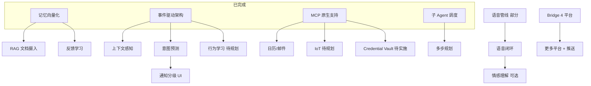

# OpenJarvis 功能扩展建议

> **文档版本**: 1.0  
> **生成日期**: 2026-05-28  
> **适用范围**: OpenJarvis v0.225.x 及后续规划  
> **相关文档**: [项目状态总结](./project-status-summary.md) | [2026 战略规划](./project-roadmap-2026.md) | [README](../README.md)

---

## 一、文档目的

本文档基于当前代码库、README 与内部规划文档，整理 **OpenJarvis 仍可扩展的功能方向**，供产品规划、Issue 拆分与迭代排期参考。  
不替代 `project-roadmap-2026.md` 的实施细节，侧重 **能力全景 + 优先级建议**。

---

## 二、项目现状概览

OpenJarvis 是本地运行的私人 AI 助理，核心定位：**有记忆、有人格、可主动行动、多 Agent 协作**，面向日常办公与通用电脑使用场景（不仅限于开发者）。

### 2.1 已具备的核心能力

| 领域 | 能力摘要 |
|------|----------|
| **记忆** | 7 层多级记忆（JSONL → 摘要 → today/week/longterm → facts.db → pinned）；FTS5 + 向量混合检索；遗忘曲线、归档、PII 脱敏 |
| **Agent** | 多 Agent 独立记忆/人格/书桌；频道群聊、私聊、任务委派；角色卡 zip 导入导出 |
| **工具** | 文件、终端、浏览器、搜索、computer_use（实验）、cron、RAG 文档摄入、plan_execute |
| **主动能力** | OSEventSource、UserContextTracker、ProactiveRuleEngine、Bridge 优先级队列 |
| **集成** | MCP 原生（Resources/Prompts/通知）；日历/邮件 MCP Presets；Telegram/飞书/QQ/微信 Bridge |
| **安全** | PathGuard 四级 + OS 沙盒；多层认证；插件 restricted/full-access |
| **客户端** | Electron 桌面（macOS/Windows/Linux）；Mobile PWA；CLI `hana`；LAN 远程连接 |
| **语音（部分）** | STT/TTS 配置页、`voice-pipeline`、语音输入工具、相关测试（42 项通过） |
| **插件** | 内置 `mcp`、`image-gen`；拖拽安装；Plugin Dev Loop |

### 2.2 已知短板（相对竞品与自评）

| 短板 | 说明 |
|------|------|
| 语音体验未闭环 | 缺唤醒词、离线引擎、专用语音对话 UI、barge-in |
| 移动端偏基础 | PWA v0：会话与工作台为主，能力弱于桌面 |
| Bridge 平台数少 | 4 个平台；部分平台不支持 proactive |
| 生态规模小 | 内置插件 2 个；社区市场未产品化 |
| 凭证隔离 | 尚无独立 Credential Vault 进程（roadmap P0） |
| 测试与文档 | 无 E2E；无 OpenAPI；部分巨型组件待拆分 |

---

## 三、功能扩展矩阵

### 3.1 Phase 4：自然交互（文档标注「待开始」）

| 功能 | 当前状态 | 建议实现内容 | 预估周期 |
|------|----------|--------------|----------|
| **语音交互闭环** | 管线 + 设置 + 工具已有 | 唤醒词（OpenWakeWord）；离线 STT（whisper.cpp/faster-whisper）+ TTS（Piper）；`VoiceMode` 全屏对话 UI；barge-in；与 Agent 事件总线解耦的语音服务进程 | 4–6 周 |
| **通知智能分级** | Bridge 已有 `urgent/normal/info` 队列 | 桌面通知中心；按级别折叠/静音/免打扰时段；与 ProactiveRuleEngine 规则绑定 | ~1 周 |
| **通讯协作增强** | Bridge 基础收发 | 富媒体/卡片消息统一；主动推送能力补齐（如微信 proactive）；消息线程与上下文策略 UI | ~2 周 |

**关键技术参考**（见 `project-roadmap-2026.md`）：           

- STT：faster-whisper（本地 GPU）/ Deepgram（云）
- TTS：Piper（离线 MIT）/ 云端备选
- 唤醒：OpenWakeWord

---

### 3.2 Phase 5：长期演进（文档标注「待规划」）

| 功能 | 依赖 | 建议实现内容 | 优先级 |
|------|------|--------------|--------|
| **IoT / 智能家居** | MCP 已完成 | Home Assistant（ha-mcp）预设；自然语言设备控制；与上下文/主动规则联动 | P2 |
| **行为模式学习** | 事件源 + 规则引擎 | 交互时间线存储 → 高频模式挖掘 → 规则建议（需用户确认）→ 效果评估 | P2 |
| **情感理解** | 可选依赖语音 | 语气/情绪标签写入记忆或回复策略（轻量，避免过度设计） | P3 |
| **多模态理解增强** | Vision 模型 | 屏幕语义理解（非仅 OCR）；可选持续感知模式 + 强隐私开关 | P1 |
| **移动端完善** | Mobile PWA | 推送、语音、Agent 切换、频道、设置、离线草稿 | P1 |

---

### 3.3 安全与协议（Roadmap P0–P1）

| 功能 | 价值 | 建议实现内容 | 预估周期 |
|------|------|--------------|----------|
| **Credential Vault** | 对标 Vellum 进程级凭证隔离 | 独立 Vault 进程；UDS/命名管道访问；MCP 凭证迁移 | 2–3 周 |
| **Prompt 注入防护** | 开放插件/MCP 生态前置条件 | `injection-detector` + 工具调用前中间件 | 1–2 周 |
| **A2A 协议** | 跨框架 Agent 互操作 | Agent Card、`/.well-known/agent.json`、Task 生命周期、委托客户端 | 3–4 周 |
| **OAuth 2.1 (MCP Auth)** | 规范合规 | 更新 MCP 认证流 | P1 |
| **Structured Output 全面采用** | 降低工具调用格式错误 | 统一 schema 校验 | 持续 |

---

### 3.4 办公场景向功能（产品差异化）

面向 README 所述「文员 / 日常办公」用户，以下功能与现有 RAG、MCP、书桌、主动引擎协同度高：

| 功能 | 说明 | 主要落点 |
|------|------|----------|
| **办公工作流模板** | 周报、会议纪要、邮件起草等一键 Skill/计划模板 | `skills2set/`、计划执行器 |
| **会议与长音频** | 分段转写、说话人分离、写入书桌/记忆、会后检索 | `lib/speech/`、RAG、记忆 facts |
| **多知识库 RAG** | 按项目/Agent 隔离；引用溯源 UI；定时重索引 | `lib/rag/`、桌面设置 |
| **日程/邮件主动闭环** | 会前摘要、待回复提醒、Bridge 推送到手机 | Hub + MCP Presets + Bridge |
| **用量与成本面板** | Token/费用按 Agent/模型/日统计；预算告警；模型降级 | `llm-usage-observer`、设置页 |
| **对话导出** | Markdown/PDF 导出；脱敏分享（局域网） | `server/routes/`、导出工具 |
| **可视化自动化** | 主动规则/定时任务图形化配置 | 设置页 + `ProactiveRuleEngine` |

---

### 3.5 生态与平台扩展

| 类别 | 现状 | 建议 |
|------|------|------|
| **Bridge 平台** | Telegram、飞书、QQ、微信 | 钉钉、企业微信、Discord、Slack；统一富媒体能力矩阵（见 `.docs/BRIDGE-MEDIA-CAPABILITIES.md`） |
| **插件市场** | 拖拽安装 + OH-Plugins 条目 | 应用内市场 UI；签名/安全审计；分类与评分 |
| **客户端形态** | Electron + PWA + CLI | 浏览器扩展（选中网页问 Agent）；托盘/菜单栏增强；原生 iOS/Android（长期） |
| **跨设备记忆同步** | 单设备 `HANA_HOME` | E2E 加密同步（Syncthing 或 CRDT）；本地优先、不上传云端 | 
| **本地多模态** | Ollama + Vision Bridge | 任务路由策略；Qwen/LLaVA 等本地视觉模型深度集成 |

---

## 四、推荐优先级

### 4.1 短期（1–2 周）：工程质量

支撑后续功能迭代，降低回归风险：

- 拆分 `createSession()`、`InputArea.tsx`、`ChannelsPanel.tsx`
- 关键路径 **Playwright E2E**（登录 → 发消息 → 记忆检索）
- Vitest **coverage** 基线（目标 70%）
- `dangerouslySetInnerHTML` 全链路审计

### 4.2 中期（1–2 月）：用户可感知能力

| 排序 | 功能 | 理由 |
|------|------|------|
| 1 | 语音闭环 | 品牌感强；README 已宣传；测试基础已有 |
| 2 | 通知分级 UI + Bridge 推送完善 | 让「主动引擎」落到日常触点 |
| 3 | Mobile PWA 能力对齐 | 已有测试与 `MobileApp`；用户远程场景多 |
| 4 | Credential Vault + 注入防护 | 生态开放前的安全底座 |

### 4.3 长期（3–6 月）：战略扩展

1. A2A 协议与跨 Agent 互操作  
2. IoT（Home Assistant MCP）  
3. 行为模式学习 → 自动规则建议  
4. 屏幕/环境多模态理解  
5. 跨设备记忆同步 + 插件/Skill 市场  

---

## 五、依赖关系简图

---

## 六、Issue 拆分示例

以下为可直接创建的 Epic / Issue 标题示例：

### Epic: 语音交互 v1

- [ ] 集成本地 STT（whisper.cpp 或 faster-whisper）与配置开关  
- [ ] 集成本地 TTS（Piper）与云端降级  
- [ ] 实现 `VoiceMode` 组件（全屏对话 + 状态机可视化）  
- [ ] 唤醒词检测（OpenWakeWord）与系统权限引导  
- [ ] barge-in：TTS 播放中打断并重新 STT  
- [ ] 更新 `docs/voice-settings-setup.md` 与 onboarding 引导  

### Epic: 通知与 Bridge 增强

- [ ] 桌面通知中心（读取 Bridge priority + 本地 notify）  
- [ ] 设置页：通知级别、免打扰时段  
- [ ] 评估微信等平台 proactive 能力与文档说明  
- [ ] 钉钉 / 企业微信 adapter 调研与 POC  

### Epic: Mobile PWA v1

- [ ] Agent 切换与多 Agent 列表  
- [ ] 推送通知（Web Push，需 HTTPS/密钥）  
- [ ] 语音输入按钮对接现有 STT API  
- [ ] 设置页精简版（模型/主题/登出）  
- [ ] 补齐 `MobileApp.test.tsx` 覆盖新流程  

### Epic: 安全加固

- [ ] Credential Vault 进程与客户端 API  
- [ ] MCP OAuth 凭证迁移至 Vault  
- [ ] Prompt 注入检测中间件 + 测试集  
- [ ] 安全审计清单文档  

---

## 七、成功指标建议

| 指标 | 当前（约） | 目标 |
|------|------------|------|
| 测试文件数 | 527+ | 600+ |
| 代码覆盖率 | 未配置 | ≥ 70% |
| E2E 核心路径 | 0 | 5–10 条 |
| Bridge 平台数 | 4 | 6–8 |
| 内置/官方插件 | 2 | 5+（含市场精选） |
| 语音模式 DAU 占比 | — | 可统计后设定基线 |
| Mobile PWA 功能对齐度 | ~40% vs 桌面 | ≥ 70% |

---

## 八、相关代码入口

| 模块 | 路径 |
|------|------|
| 语音管线 | `lib/speech/voice-pipeline.js` |
| 语音路由 | `server/routes/voice.js` |
| 语音设置 UI | `desktop/src/react/settings/tabs/VoiceTab.tsx` |
| 语音输入 | `desktop/src/react/components/input/VoiceButton.tsx` |
| Mobile | `desktop/src/react/mobile/MobileApp.tsx` |
| Bridge 管理 | `lib/bridge/bridge-manager.js` |
| Bridge 优先级 | `lib/bridge/priority-queue.js` |
| 主动规则 | `lib/proactive/`（以实际目录为准） |
| 记忆 | `lib/memory/` |
| MCP 插件 | `plugins/mcp/` |
| 插件开发 | `PLUGINS.md`、`.docs/PLUGIN-DEVELOPMENT.md` |

---

## 九、总结

OpenJarvis 已完成 **Phase 1–3** 的主体建设（记忆、主动能力、MCP、规划执行、RAG 等），具备从「被动问答」到「主动助理」的基础设施。

**下一步最值得投入的三条线：**

1. **语音闭环** — 完成「真正的 Jarvis」交互形态  
2. **通知 + Bridge** — 把主动能力送到用户日常使用的渠道  
3. **安全底座（Vault + 注入防护）** — 为插件市场与更多 MCP 做准备  

办公场景向功能（模板、会议、知识库、成本面板）可与上述三条线并行，按用户反馈迭代。

---

## 十、文档维护

| 字段 | 说明 |
|------|------|
| 维护者 | 产品 / 核心开发 |
| 更新触发 | 大版本发布、Phase 完成、竞品调研更新 |
| 上游输入 | `project-status-summary.md`、`project-roadmap-2026.md`、`jarvis-gap-analysis.md` |

**变更记录**

| 日期 | 版本 | 说明 |
|------|------|------|
| 2026-05-28 | 1.0 | 初版：功能扩展建议全景 |
